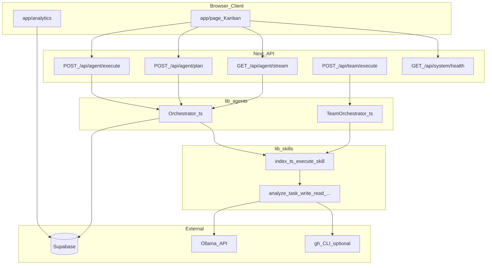

# 시스템 개요

태그: `#architecture` `#overview`

Basalt는 **Next.js(App Router) UI**가 **API 라우트**를 통해 **Orchestrator**를 호출하고, Orchestrator가 **스킬 레이어**와 **Ollama(LLM)**·**Supabase**·(선택) **Git/`gh`**와 연동하는 구조입니다.

---

## 구성도

---

## 디렉터리 맵 (요약)

| 경로 | 역할 |
|------|------|
| `app/` | 페이지(`page.tsx`), 레이아웃, `app/api/**/route.ts` REST·SSE 엔드포인트 |
| `components/` | 칸반, 태스크/프로젝트 모달, 로그 뷰, 분석·팀 시각화 UI |
| `lib/agents/` | `Orchestrator`, `TeamOrchestrator` — 상태·락·워크플로 실행 |
| `lib/skills/` | 스킬별 `execute.ts` 및 `lib/skills/index.ts` 집약 실행기 |
| `lib/llm.ts` | Ollama HTTP 클라이언트, 코드 생성·JSON 파싱 |
| `lib/profiler.ts` | 대상 프로젝트 스택·패키지·라우트 컨텍스트 |
| `lib/supabase.ts` | 클라이언트 Supabase 싱글톤 |
| `docs/` | 아키텍처, API, 프롬프트 계약, 기능 목록 |

상세 동작은 [orchestrator.md](./orchestrator.md), [team-orchestrator.md](./team-orchestrator.md)를 참고합니다.
