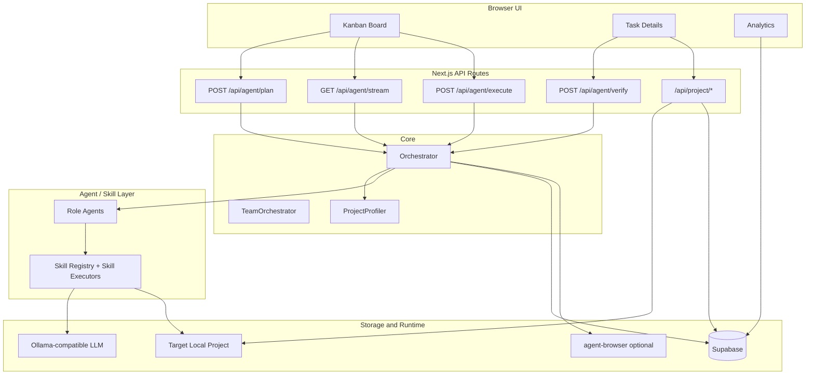

# 시스템 개요

태그: `#architecture` `#overview` `#data-flow`

Basalt는 **Next.js App Router UI**가 **API Route**를 통해 **Orchestrator**를 호출하고, Orchestrator가 **Agent/Skill 레이어**, **Ollama 호환 LLM**, **Supabase**, 대상 로컬 프로젝트와 연동하는 구조입니다.

## 한 줄 구조

```text
Browser UI -> Next.js API Route -> Orchestrator -> Agent/Skill -> LLM 또는 대상 프로젝트 -> Supabase 로그/메타데이터 -> Browser UI
```

## 사용자 액션 기준 데이터 흐름

| 사용자 액션 | 내부 처리 | 저장/표시 결과 |
| --- | --- | --- |
| 프로젝트 등록 | `Projects` 테이블에 이름과 로컬 path 저장 | 프로젝트 선택 목록 |
| 태스크 생성 | `Tasks`에 `pending` 상태 태스크 저장 | 칸반 `Request` 카드 |
| Plan 실행 | Orchestrator가 `analyze_task`, `create_workflow`, `consult_agents` 실행 | `Tasks.workflow`, plan 로그 |
| Execute 실행 | workflow step별 skill 실행, 필요 시 LLM 코드 생성/수리 | `Execution_Logs`, `metadata.fileChanges` |
| Test/검증 | QA smoke, verify, screenshot/responsive 캡처 | `metadata.qaPageCheck`, `metadata.qaSignoff` |
| 후속 정리 | 실행 메타데이터 기반 복구/인수인계 Markdown 생성 | Task Details 패널 |

## 구성도



## 기술 선택 이유

- **Next.js App Router**: 화면과 API를 한 저장소에서 빠르게 구성해 프로토타입 데모에 적합합니다.
- **Supabase**: 태스크 상태, 실행 로그, 메타데이터를 저장하고 Realtime으로 UI를 갱신하기 쉽습니다.
- **Ollama 호환 LLM 호출**: 로컬 또는 사내 인프라 모델로 계획, 분석, 코드 생성, 검증을 분리할 수 있습니다.
- **Orchestrator + Agent + Skill**: 단일 프롬프트가 아니라 역할과 실행 단위를 나눠 계획, 실행, 검증, 수리 루프를 관리합니다.
- **ProjectProfiler**: 대상 프로젝트의 실제 stack, package, router, UI 컴포넌트 정보를 프롬프트에 넣어 AI의 추측을 줄입니다.

## 디렉터리 맵

| 경로 | 역할 |
| --- | --- |
| `app/` | 페이지, 레이아웃, `app/api/**/route.ts` API/SSE 엔드포인트 |
| `components/` | 칸반, 태스크 상세, 프로젝트 선택, 로그, QA/분석 UI |
| `lib/agents/` | `Orchestrator`, `TeamOrchestrator`, 역할별 agent |
| `lib/skills/` | 스킬 정의, 실행기, registry, 코드 쓰기/검증 로직 |
| `lib/prompts/` | 코드 생성, 파일 포맷, 수술 편집, 다단계 plan 프롬프트 |
| `lib/profiler.ts` | 대상 프로젝트 스택·패키지·라우트 컨텍스트 수집 |
| `lib/supabase.ts` | Supabase 클라이언트 |
| `supabase/schema.sql` | 최소 실행용 DB 스키마 |
| `docs/` | 기능, 운영, 아키텍처 문서 |

상세 실행 흐름은 [`orchestrator.md`](./orchestrator.md), 팀 오케스트레이션은 [`team-orchestrator.md`](./team-orchestrator.md)를 참고하세요.
